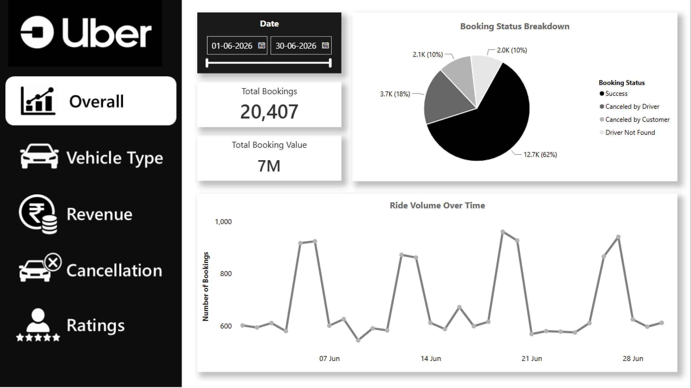
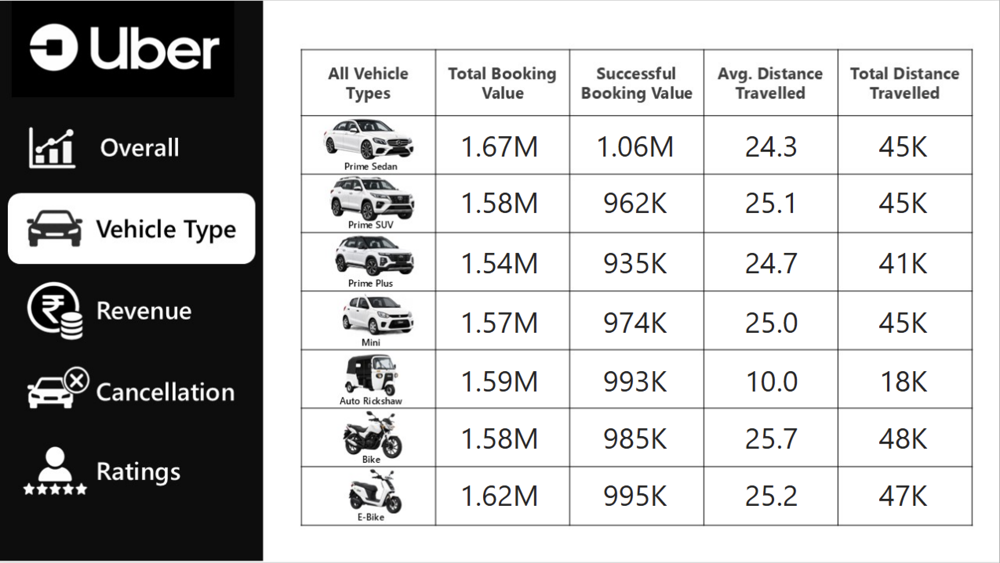
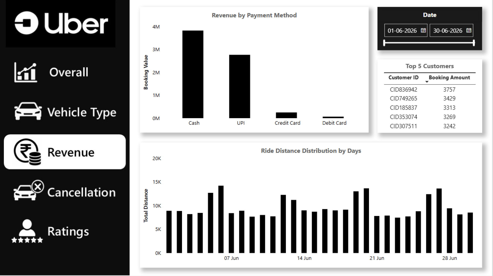
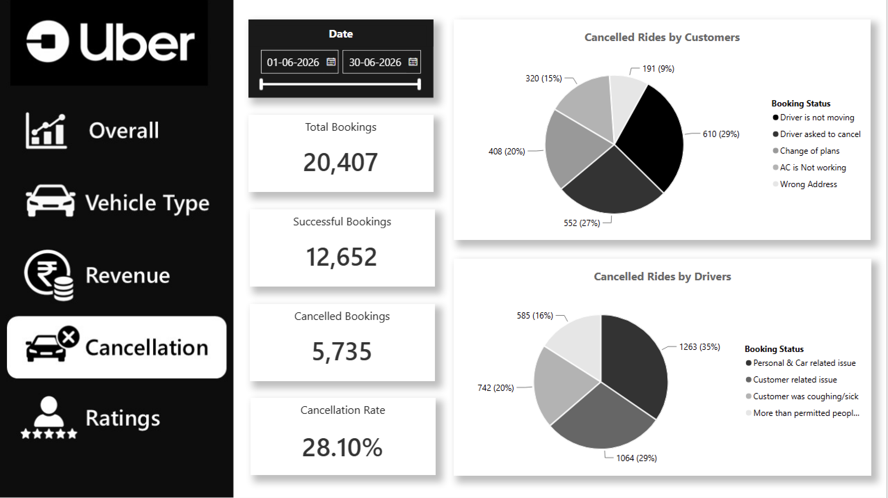
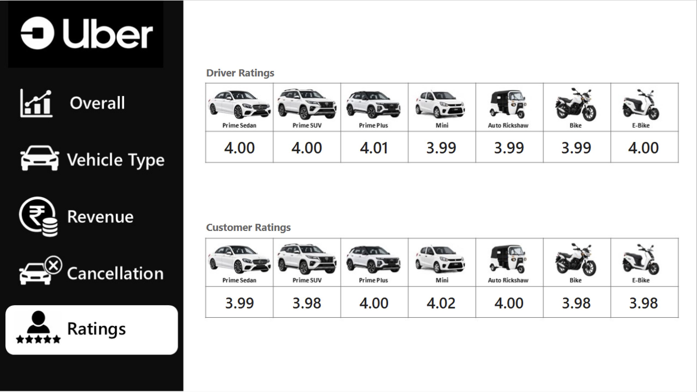

# <h1 align="center">Uber Ride Data Analysis | SQL & Power BI</h1>

<p align="center">
  End-to-End Data Analysis using SQL and Power BI
</p>

<p align="center">
  
  
  
</p>

---

## Overview

This project presents an end-to-end analysis of Uber ride booking data using **SQL** and **Power BI**. It focuses on analysing booking patterns, ride cancellations, revenue, customer behaviour, payment methods, and driver performance through SQL queries and an interactive Power BI dashboard.

---

## Business Problem

Ride-hailing companies generate thousands of bookings every day. Analysing this data helps answer key business questions such as:

- How many rides are successfully completed?
- Which vehicle types are used the most?
- Why are rides being cancelled?
- Which customers generate the highest booking value?
- Which payment methods are preferred?
- How do customer and driver ratings compare?
- What trends exist in booking volume and revenue?

This project demonstrates how SQL and Power BI can be combined to answer these business questions and create actionable insights.

---

## Project Objectives

- Analyse ride booking data using SQL.
- Build reusable SQL views for business reporting.
- Create an interactive Power BI dashboard.
- Monitor ride volume, cancellations, revenue, and customer behaviour.
- Visualise operational performance through KPIs and charts.

---

## Dataset Information

| Attribute | Details |
|-----------|---------|
| Dataset Size | 20,407 Records |
| Total Columns | 19 |
| Domain | Ride-Hailing / Transportation |
| Location | Delhi NCR |
| Tools Used | SQL, Power BI, Excel |

### Dataset Columns

- Date
- Time
- Booking ID
- Booking Status
- Customer ID
- Vehicle Type
- Pickup Location
- Drop Location
- Vehicle TAT
- Customer TAT
- Customer Cancellation Reason
- Driver Cancellation Reason
- Incomplete Ride
- Incomplete Ride Reason
- Booking Value
- Payment Method
- Ride Distance
- Driver Rating
- Customer Rating

---

## Tools & Technologies

| Tool | Purpose |
|------|---------|
| SQL (MySQL) | Data querying and business analysis |
| Power BI | Dashboard creation and visualisation |
| Microsoft Excel | Dataset preparation |

---

## SQL Concepts Demonstrated

- SELECT
- WHERE
- GROUP BY
- ORDER BY
- LIMIT
- Aggregate Functions
  - COUNT()
  - SUM()
  - AVG()
  - MAX()
  - MIN()
- SQL Views

---

## SQL Business Analysis

The SQL analysis addresses the following business questions:

1. Retrieve all successful bookings.
2. Calculate the average ride distance for each vehicle type.
3. Count rides cancelled by customers.
4. Identify the top 5 customers based on ride bookings.
5. Count rides cancelled by drivers due to personal or vehicle-related issues.
6. Find the maximum and minimum driver ratings for Prime Sedan rides.
7. Retrieve bookings paid through UPI.
8. Calculate the average customer rating for each vehicle type.
9. Calculate the total booking value of successful rides.
10. List incomplete rides along with their reasons.

> **Note:** Complete SQL queries are available in the `Uber-sql-data-analysis.sql` file.

---

## Dashboard Overview

The dashboard consists of **5 interactive report pages**.

### 1. Overall

Provides a complete overview of the business through KPIs and booking trends.

**Highlights**

- Total Bookings
- Total Revenue
- Booking Status Distribution
- Ride Volume Trend
- Interactive Filters

---

### 2. Vehicle Type

Analyses vehicle-wise performance.

**Highlights**

- Ride Distribution
- Booking Value by Vehicle Type
- Average Ride Distance
- Customer Ratings by Vehicle

---

### 3. Revenue

Focuses on financial performance.

**Highlights**

- Revenue Trend
- Revenue by Payment Method
- Top Customers
- Booking Value Analysis

---

### 4. Cancellation

Analyses operational losses caused by ride cancellations.

**Highlights**

- Customer Cancellation Reasons
- Driver Cancellation Reasons
- Cancellation Distribution
- Cancellation KPIs

---

### 5. Ratings

Measures customer satisfaction and driver performance.

**Highlights**

- Customer Rating Distribution
- Driver Rating Distribution
- Rating Comparison
- Vehicle-wise Ratings

---

## Power BI Features

- Interactive Dashboard
- KPI Cards
- Slicers
- Navigation Buttons
- Drill-down Analysis
- Dynamic Visualisations
- Uber-inspired Theme
- Responsive Report Layout

---

## Repository Structure

```text
Uber-Ride-Data-Analysis/
│
├── Images/
│   ├── Overall.png
│   ├── Vehicle Type.png
│   ├── Revenue.png
│   ├── Cancellation.png
│   └── Ratings.png
│
├── Dashboard/
│   └── Uber Power Bi Data Analysis.pbix
│
├── SQL/
│   └── Uber-sql-data-analysis.sql
│
├── Dataset/
│   └── Uber.csv
│
└── README.md
```

---

## Dashboard Preview

### Overall Dashboard



### Vehicle Type Analysis



### Revenue Analysis



### Cancellation Analysis



### Ratings Analysis



---

## Getting Started

1. Clone this repository.
2. Open `Uber Power Bi Data Analysis.pbix` in Power BI Desktop.
3. Open `Uber-sql-data-analysis.sql` in MySQL Workbench (or any compatible SQL client).
4. Import the `Uber.csv` dataset if required.
5. Explore the dashboard and SQL analysis.

---

## Project Highlights

- End-to-end SQL and Power BI project.
- Interactive business dashboard.
- Analysis of bookings, revenue, cancellations, ratings, and payment methods.
- Reusable SQL Views for reporting.
- Customised dataset using Delhi NCR locations and updated timestamps.

---

## Key Insights

The dashboard provides valuable business insights into Uber ride operations, including:

- Monitors ride booking trends over time to identify demand patterns.
- Compares booking distribution across different vehicle categories.
- Analyses customer and driver cancellation behaviour.
- Tracks revenue generated through various payment methods.
- Identifies top customers based on total booking value.
- Evaluates customer and driver ratings to measure service quality.
- Compares average ride distance across vehicle types.
- Highlights incomplete rides and their associated reasons.

---

## Author

**Ashish Gautam**

Data Analyst | Power BI | Excel | SQL


📧 **Email:** ashishgautam323@gmail.com

🔗 **LinkedIn:** https://www.linkedin.com/in/theashishgautam
